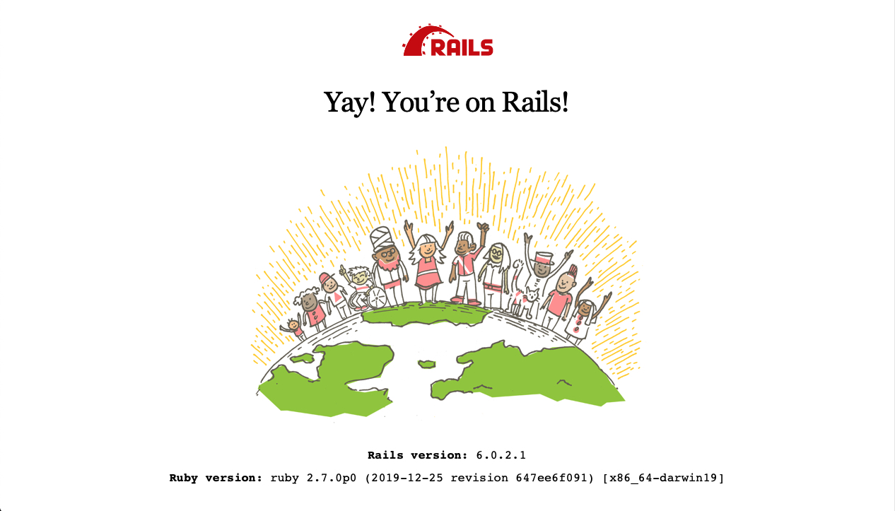
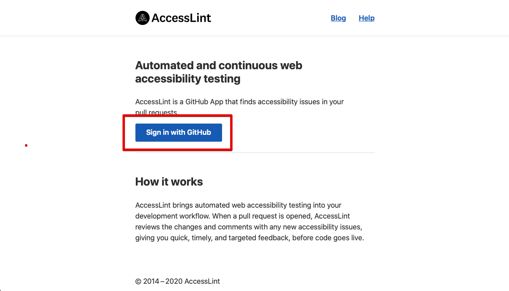
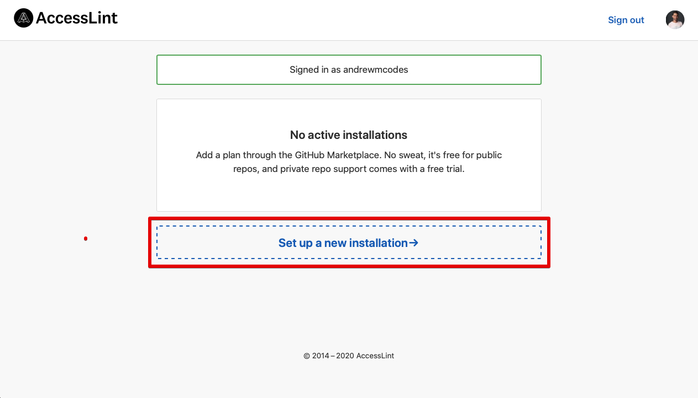
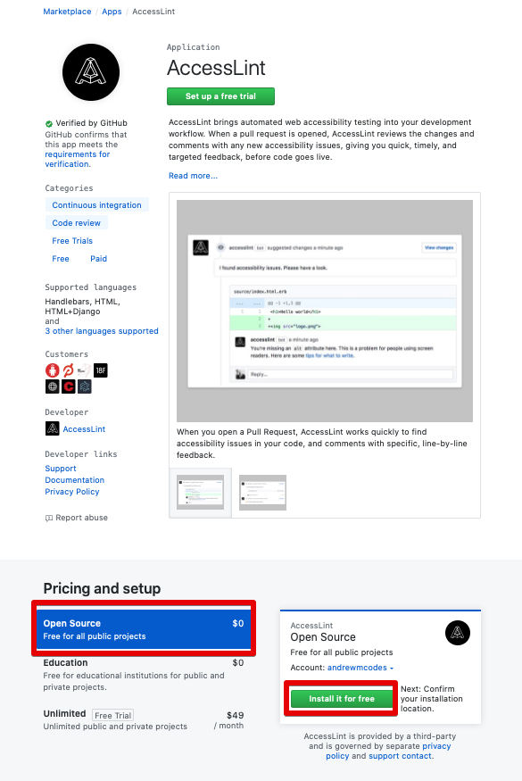
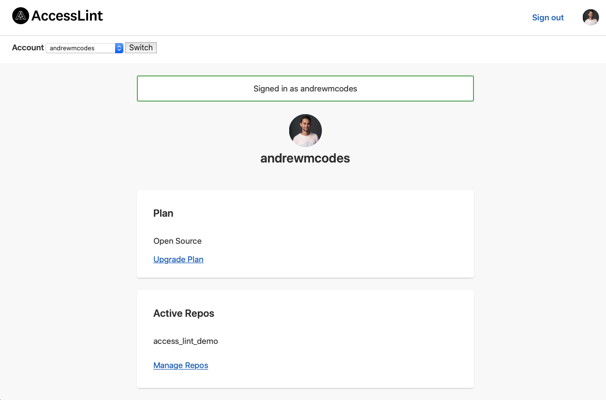
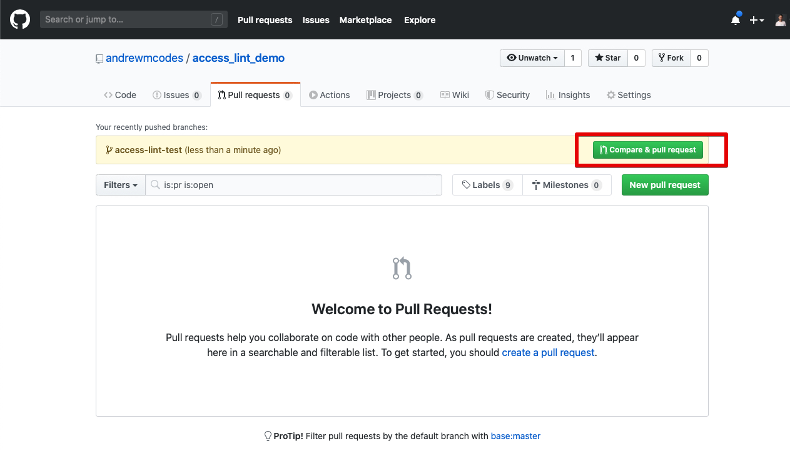

# AccessLint

According to their documentation, AccessLint is:

>AccessLint brings automated web accessibility testing into your development workflow. When a pull request is opened, AccessLint reviews the changes and comments with any new accessibility issues, giving you quick, timely, and targeted feedback, before code goes live.

## Demo

## Setup

Let's create a new Rails app and `cd` into it:

```sh
rails new access_lint_demo
cd access_lint_demo
```

Then setup the database:

```sh
bin/rails db:setup
```

And install dependencies

```sh
bundle install
yarn install
```

Now, let's start the Rails server:

```shell
rails s
```

If you want to run the `webpack-dev-server`, run this in another tab:

```shell
bin/webpack-dev-server
```

If you navigate to `localhost:3000` in your browser, you should see the Rails welcome page:



### Create Repository

Open GitHub and create a new repository. I named mine `access_lint_demo`.

Open your command line again and let's upstream our code.

```sh
git add .
git commit -m "first commit"
git remote add origin https://github.com/YOUR_USERNAME/access_lint_demo.git
git push -u origin master
```

Your code should now be online in your repo.

## AccessLint

Navigate to [AccessLint](https://accesslint.com) in your browser, and click `Sign in with Github`:



After you authenticate with GitHub, you should be redirected back to the AccessLint setup page. Click `Set up a new installation`:



You should get redirected to the AccessLint app on the GitHub Marketplace. Click `Open Source` under the `Pricing and setup` header, and then `Install it for free`:



Choose whether you want to install the AccessLint app for all your repos or specifically select your demo repo, and accept the permissions.

AccessLint should now be installed!



## Test it out

Let's test it out on a new branch. Run the following in your terminal:

```sh
git checkout -b access-lint-test
```

This should create a new branch in your demo repo. Now, let's scaffold some code:

```sh
bin/rails g scaffold Post title:string content:text
bin/rails db:migrate
```

This will scaffold out some resources for us and add `Post` to our database schema. Most importantly, it will create some new views.

Restart your Rails server and open `localhost:3000/posts` to make sure everything is working correctly


Let's also make a change to `app/views/posts/_form.html.erb` that will trigger a failing lint. We are going to add an inaccessible image to the Post index page:

Add the following to `app/views/posts/index.html.erb`:

```html

```

Since this image does not have an `alt` attribute, it should be flagged by AccessLint.

Let's commit this code to see if that is correct:

```sh
git add .
git commit -m "create Post resource"
git push --set-upstream origin access-lint-test
```

Now open the repo on GitHub and open a pull request for these changes:


